# Assembly Guide

This guide describes how to assemble **PrintExo** from 3D-printed components, off-the-shelf mechanical parts, and electronics.

---

## 1. Overview

PrintExo uses a modular architecture organized into three main subsystems:

| Subsystem | Description |
|-----------|-------------|
| Actuation module | Motor, planetary gear stage, protective casing |
| Shank structure | Vertical frame, passive hinge, calf attachment |
| Shoe interface | Dorsal component, plantar guides, lace integration |

Assembly follows a bottom-up approach: gearbox → actuation module → shank → shoe interface.

---

## 2. Before You Begin

### Checklist

- [ ] All 3D-printed parts completed and post-processed
- [ ] All BOM components available (bearings, fasteners, motor)
- [ ] Required tools prepared
- [ ] Clean, well-lit workspace

### Recommended Preparation

1. **Verify printed parts** — check for warping, incomplete features, or layer defects
2. **Ream all holes** — use appropriate drill bits to clean up M3 holes
3. **Tap threads** — tap M3 holes where bolts will be inserted
4. **Dry-fit bearings** — ensure press-fit is snug but not cracked

---

## 3. Required Tools

| Tool | Size/Spec | Purpose |
|------|-----------|---------|
| Hex key set | 2.5 mm (for M3) | Tightening bolts |
| Screwdriver | Phillips / Flat | General fastening |
| Drill bits | 2.5 mm, 3.0 mm | Hole reaming |
| Hand tap | M3 × 0.5 | Threading holes |
| Needle-nose pliers | — | Support removal, small parts |
| Calipers | — | Dimensional verification |
| Power drill (optional) | — | Speeds up drilling/tapping |

---

## 4. Assembly Steps

---

### Step 1 — Sun Gear Assembly

Fit the **Sun Gear** to the **Sun Gear Holder**.

---

### Step 2 — Align Screw Holes

Align the screw holes.

---

### Step 3 — Fasten Sun Gear

Fasten using **six (6) M3 × 22 mm screws** until each screw contacts the bottom surface.

---

### Step 4 — Mount Sun Gear to Actuation Module

Align the **Sun Gear** with the **six (6) screw holes** on the **Actuation Module (CubeMars AK60-6 V1.1 KV140)**. Fasten in the specified order, then tighten fully.

> ⚠️ **Caution:** Do not let any screw tilt the Sun Gear contact surface.

---

### Step 5 — Planet Gear Bearing Installation

Insert **one (1) HK0810 (8×12×10)** into each of the **four (4) Planet Gears**.

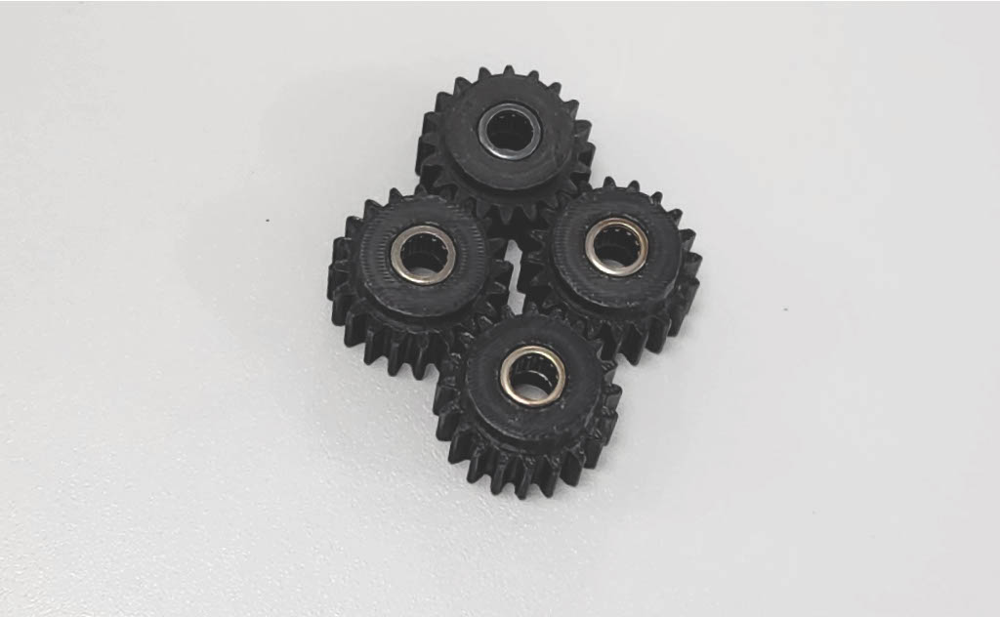

---

### Step 6 — Ring Gear Installation

Align the **Ring Gear** with the **Actuation Module**, then insert it fully.

---

### Step 7 — Secure Ring Gear

Fasten using **six (6) M3 × 5 mm screws** in the specified order, then tighten fully.

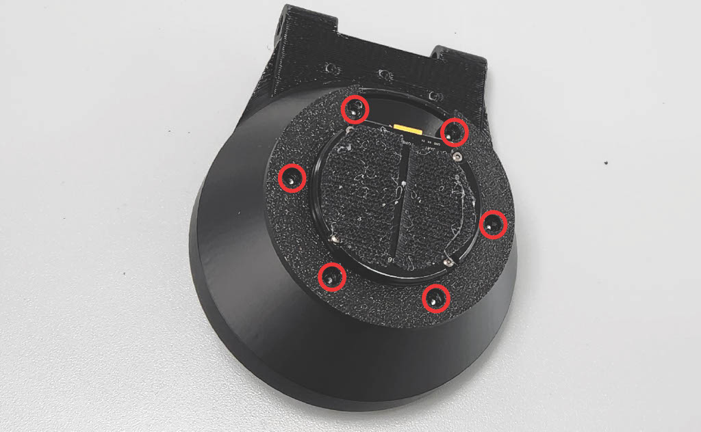

---

### Step 8 — Carrier Bearing Installation

Insert **one (1) HK0810 (8×12×10)** into the **Carrier**.

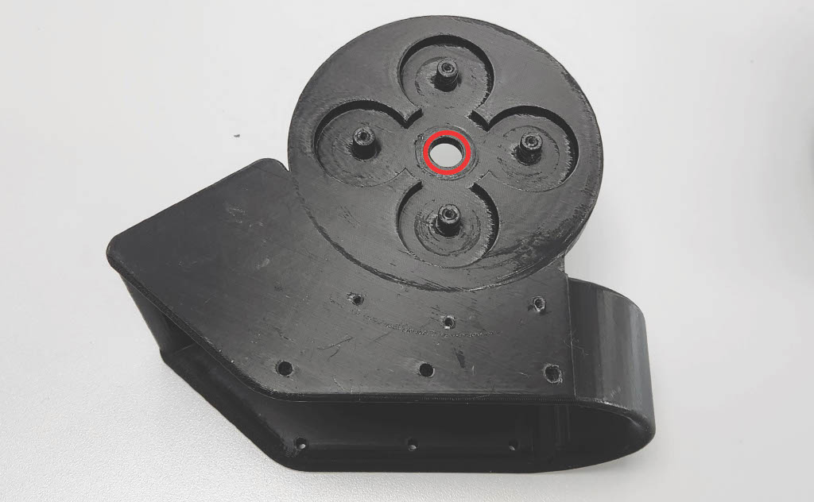

---

### Step 9 — Medial Gearbox Bracket

Align the **Medial Gearbox Bracket** with the bearing, then insert it fully.

---

### Step 10 — Planet Gears Installation

Align the **four (4) Planet Gears** with the bearings, then insert them fully.

---

### Step 11 — Sun Gear Engagement

Align the **Actuation Module Sun Gear** with the bearing, then insert it fully.

> ⚠️ **Caution:** Align the teeth of the four (4) Planet Gears with the teeth of the Sun Gear.

---

### Step 12 — Carrier Fastening

Insert **M3 flat washers**, then fasten the **Carrier** to the **Actuation Module** using **two (2) M3 × 22 mm screws**. Tighten fully.

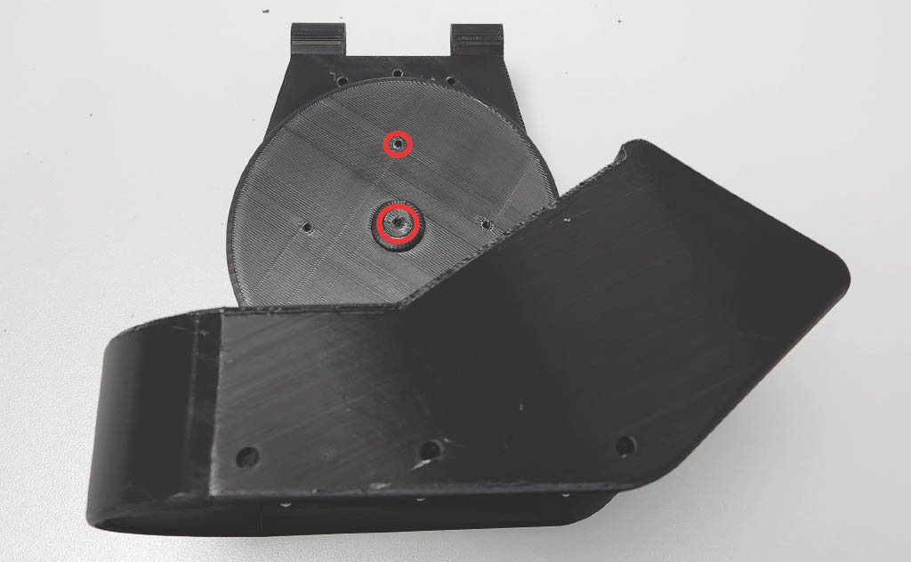

---

### Step 13 — Medial Cover

Fasten the **Medial Cover** using **three (3) M3 × 22 mm screws**. Tighten fully.

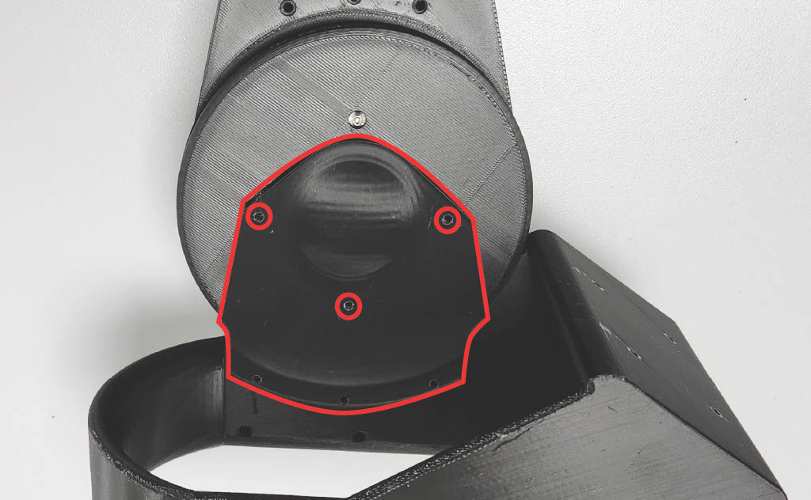
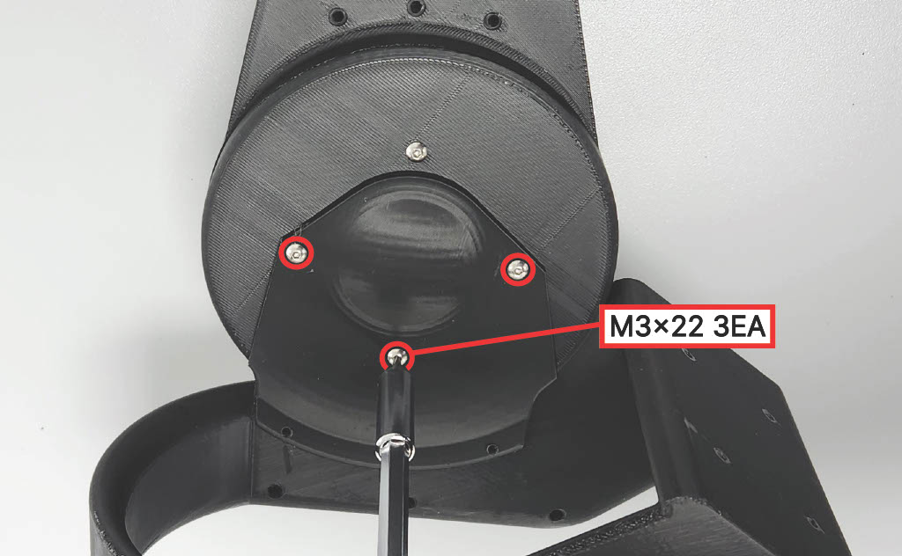

---

### Step 14 — Lower Bracket

Fasten the **Lower Bracket** using **three (3) M3 × 22 mm screws**. Tighten fully.

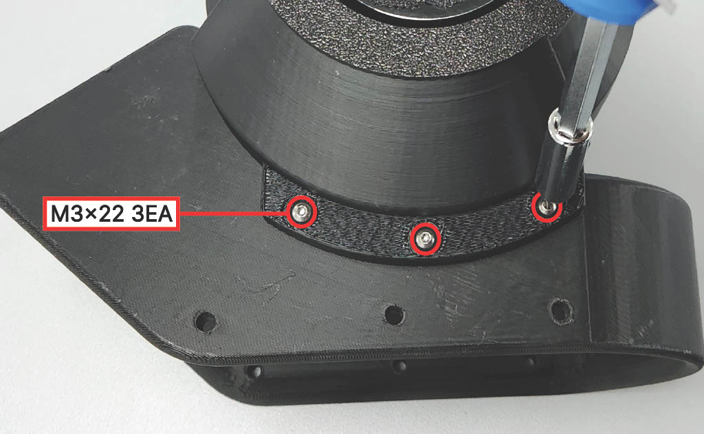

---

### Step 15 — Check Assembly

Check that there are no gaps between modules.

---

### Step 16 — Passive Hinge Bearings

Insert **two (2) HK0810 (8×12×10)** into the holes in the **Passive Hinge** section of the **Shank Structure**.

---

### Step 17 — Shank Structure & Hinge Pin

Fit the **Shank Structure** to the **Ring Gear**. Insert the **Hinge Pin**, then fasten using **one (1) M3 × 40 mm screw**. Tighten fully.

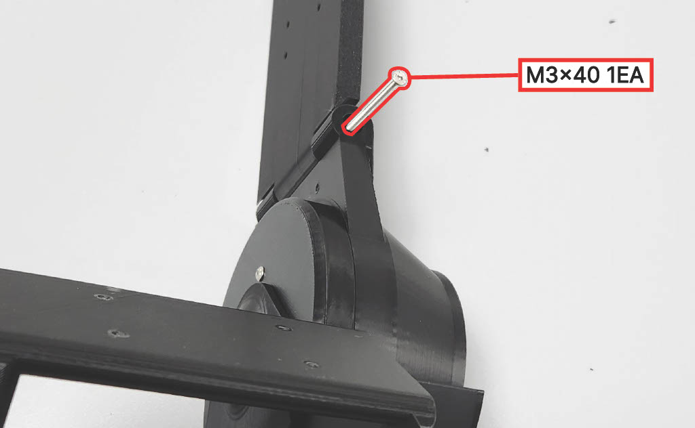

---

### Step 18 — Upper Bracket to Hinge Pin

Fasten the **Upper Bracket** to the **Hinge Pin** using **one (1) M3 × 40 mm screw**. Tighten fully.

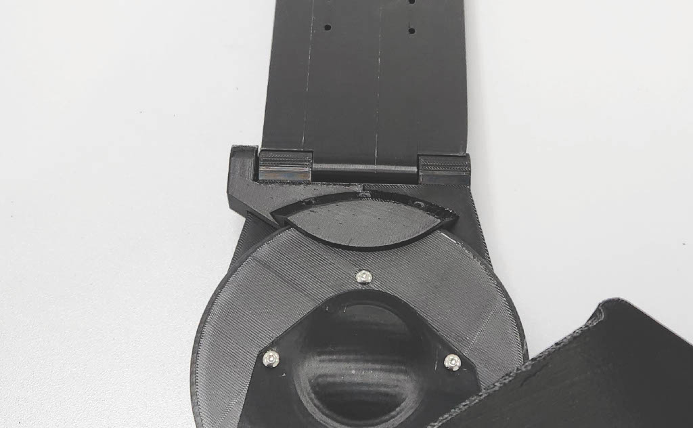

---

### Step 19 — Upper Bracket to Ring Gear

Fasten the **Upper Bracket** to the **Ring Gear** using **three (3) M3 × 22 mm screws**. Tighten fully.

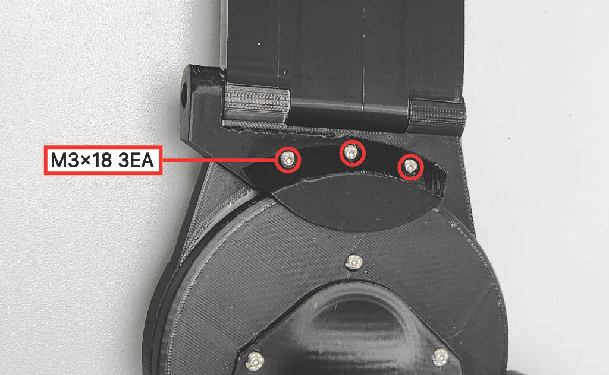

---

### Step 20 — Calf Compression Sleeve & Strap Anchor

Fasten the **Calf Compression Sleeve** and **Strap Anchor** to the **Shank Structure** using **four (4) M3 × 22 mm screws**. Tighten fully.

> ⚠️ **Caution:** Select the size option based on the user's shank length, then fasten through the corresponding holes.

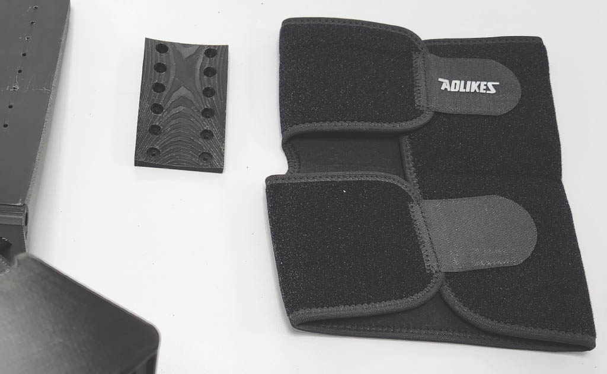

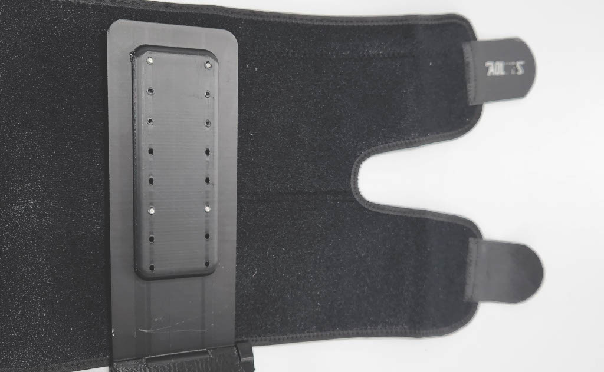

---

### Step 21 — Wire Guide

Fasten the **Wire Guide** using **four (4) M3 × 22 mm screws**. Tighten fully.

---

### Step 22 — Dorsal Interface

Fasten the shoe-mounted **Dorsal Interface** to the **Carrier** using **four (4) M3 × 20 mm screws**. Tighten fully.

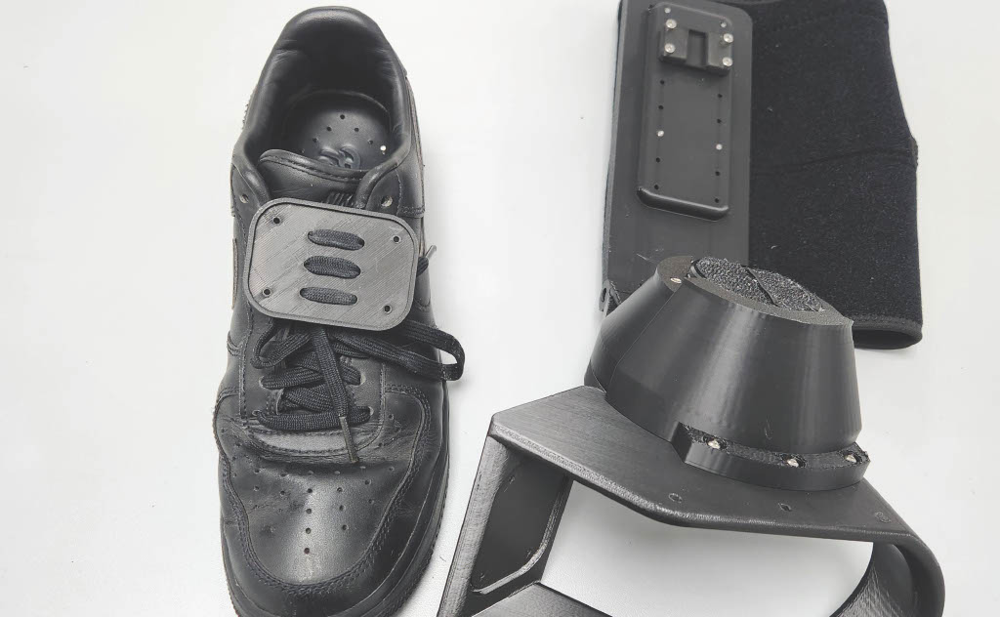

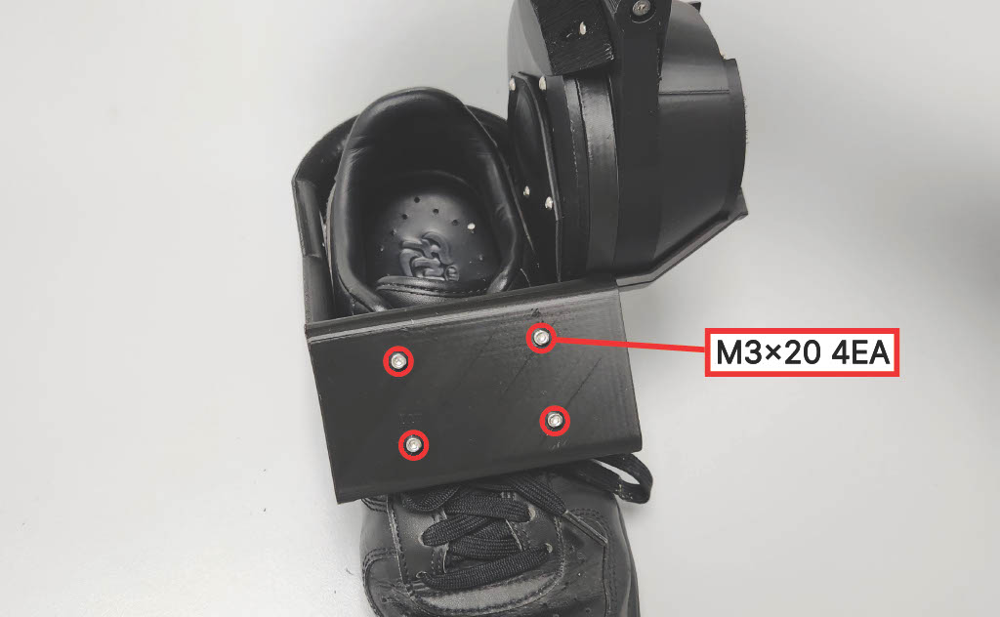

---

### Step 23 — Auxiliary Lace

Use the **Auxiliary Lace** to fasten the **Carrier** to the shoe.

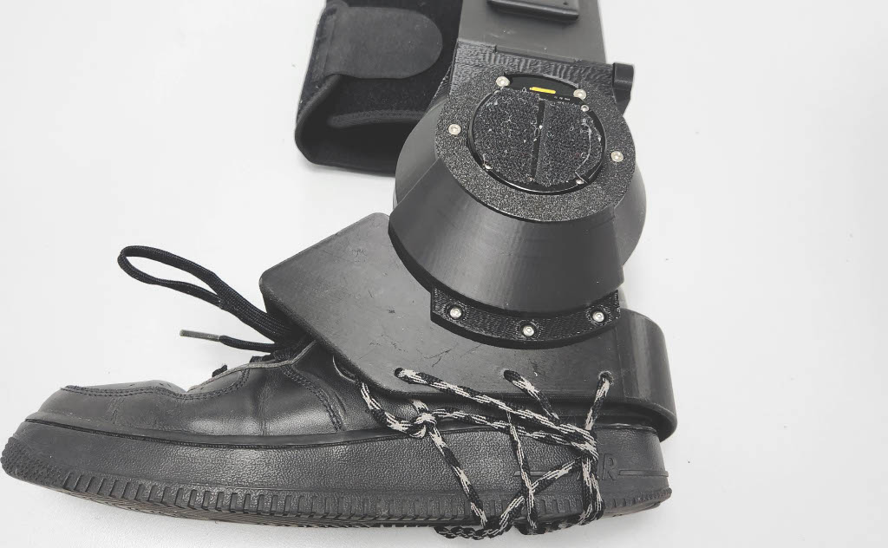

---

### Step 24 — Complete 🎉

Assembly complete.

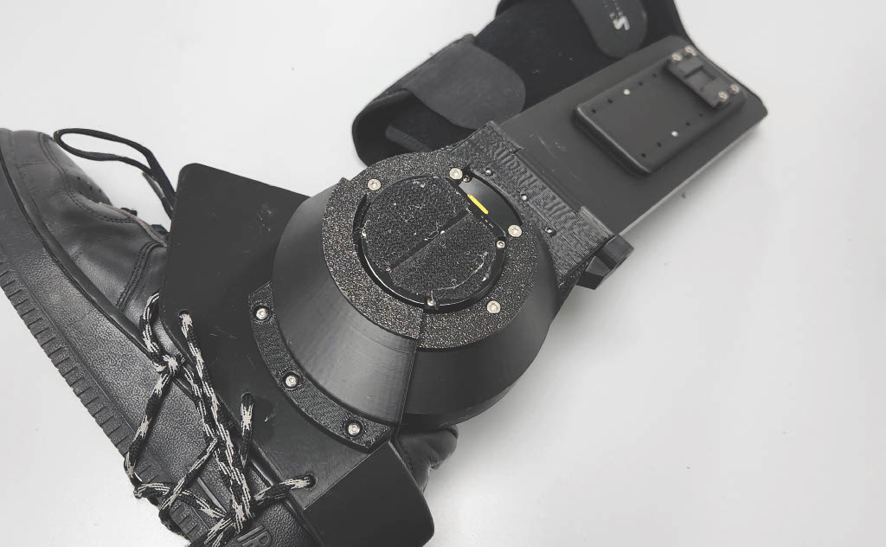

---

## 5. Alignment & Fit Verification

After assembly, perform the following checks:

### Mechanical Checks

| Check | Expected Result |
|-------|-----------------|
| Gearbox rotation | Smooth, no grinding or binding |
| Hinge movement | Free inversion/eversion motion |
| Motor operation | Spins without obstruction |
| Shoe interface rigidity | No wobble at mounting point |

### Fit Checks

- [ ] Shank aligned with lateral side of lower leg
- [ ] Ankle joint axis approximately aligned with device axis
- [ ] Calf sleeve secure but comfortable
- [ ] Laces tensioned evenly across dorsal interface
- [ ] No pinch points during range of motion test

---

## 6. Safety Notes

- **Do not over-tighten** M3 bolts — PLA can crack under excessive torque
- **Inspect all structural joints** before human testing
- **Check for pinch points** around hinge and gearbox
- **Verify motor is unpowered** during mechanical assembly
- **Perform bench test** before wearing the device
- **Start with zero-torque mode** for initial human trials

---

## 7. Next Steps

After completing mechanical assembly, proceed to:

- [Electronics & Control Overview](../elec_control/index.md)
- [Motor Driver & Configuration](../elec_control/motor.md)
- [Wiring](../elec_control/wiring.md)
- [Running Demo](../elec_control/demo.md)
